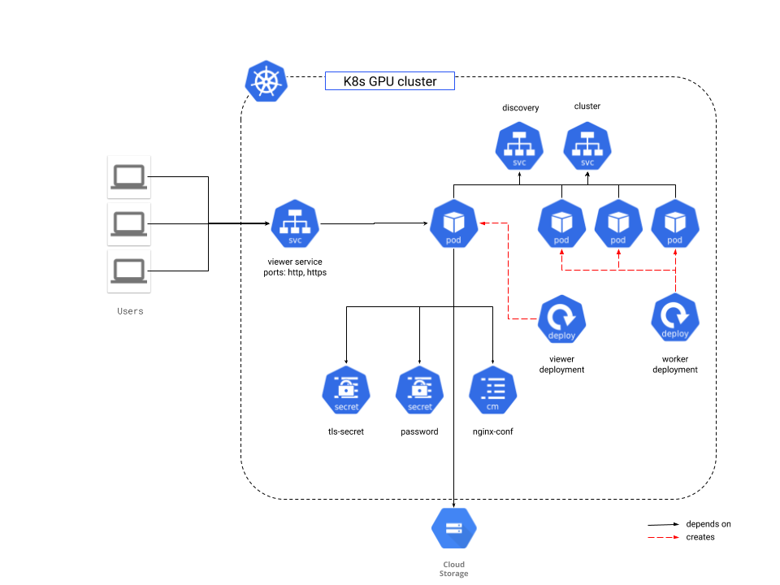

# Overview

NVIDIA IndeX is a 3D volumetric, interactive visualization SDK.
Scientists and researchers use NVIDIA IndeX to visualize and interact with massive data sets,
make real-time modifications, and navigate to the most pertinent parts of the
data, all in real-time, making it possible to gather better insights faster. IndeX leverages GPU-accelerated
clusters for scalable, real-time, visualization and computing of multi-valued,
volumetric data together with embedded geometry data.

To learn more about NVIDIA IndeX, go to [page](https://developer.nvidia.com/index).

This application allows you to run NVIDIA IndeX in a Kubernetes cluster. The
viewer that comes bundled with the NVIDIA IndeX release is used. By default, the viewer loads
and displays a rendered demo dataset. TODO: reference. Users can also load their own data in
NVIDIA IndeX as described in the [Loading your own data](#loading-your-own-data) section.

The Kubernetes cluster in which the NVIDIA IndeX application is installed requires
NVIDIA GPUs for the application to run correctly.

The application can be launched either by "Click to Deploy" directly from the
Google Marketplace or by using the command line. Both launch choices are described in this
document.


## Architecture 



The application starts an NVIDIA IndeX cluster instance, available from the
exposed viewer service on HTPP and HTTPS. The session is protected by a user ID
(nvindex) and a password. The password can be entered manually when launching the application 
from the command line interface or generated automatically when using "Click To Deploy".

The TLS certificates are generated automatically for "Click to Deploy" (self
signed). When using the command line interface, they have to be provided by the user. More details are
provided in the [Update your SSL certificate](#update-your-ssl-certificate)
section.

To achieve scaling of large volume data, NVIDIA IndeX runs in a cluster. For a cluster
of N pods, one node has the additional responsibility of serving the
UI (viewer?). All the other pods are workers. That means there is one viewer and N-1 workers
in a cluster of N nodes. In Kubernetes, this is modeled using two deployments:
    - The viewer stateful set: which has one replica.
    - The worker deployment: which has N-1 replicas.

For a cluster of size 1 (N=1), there is one viewer and zero workers.

A ClusterIP service is provided to provide the worker nodes with a discovery node address.
For public access, a LoadBalancer service is provided that points to the viewer
pod.

Loading your own data is covered in the [Loading your own data](#loading-your-own-data) section.


# Installation

## Quick Install using Google Cloud Marketplace

For a quick look at NVIDIA IndeX, you can launch it directly from the Google
Cloud Marketplace. Follow the
[on-screen instructions](https://console.cloud.google.com/marketplace/details/google/nvindex).

Before launching, make sure that you have NVIDIA GPUs available in the cluster.

## Command line instructions

### Prerequisites

You will need the following tools in your development environment. If you are
using Cloud Shell, `gcloud`, `kubectl`, Docker, and Git are installed in your
environment by default.

-   [gcloud](https://cloud.google.com/sdk/gcloud/)
-   [kubectl](https://kubernetes.io/docs/reference/kubectl/overview/)
-   [docker](https://docs.docker.com/install/)
-   [git](https://git-scm.com/book/en/v2/Getting-Started-Installing-Git)
-   [helm](https://helm.sh/)

Configure `gcloud` as a Docker credential helper:

```shell
gcloud auth configure-docker
```

#### Create a Google Kubernetes Engine cluster

Create a new cluster from the command line:

```shell
export CLUSTER=nvindex-cluster
export ZONE=us-west1-a

gcloud container clusters create "$CLUSTER" --zone "$ZONE"
```

Configure `kubectl` to connect to the new cluster.

```shell
gcloud container clusters get-credentials "$CLUSTER" --zone "$ZONE"
```

#### Clone this repo

Clone this repo and the associated tools repo.

```shell
git clone --recursive https://github.com/NVIDIA/nvindex-cloud.git
```

#### Install the Application resource definition

An Application resource is a collection of individual Kubernetes components,
such as Services, Deployments, and so on, that you can manage as a group.

To set up your cluster to understand Application resources, run the following
command:

```shell
kubectl apply -f "https://raw.githubusercontent.com/GoogleCloudPlatform/marketplace-k8s-app-tools/master/crd/app-crd.yaml"
```

You need to run this command once per Kubernetes cluster.

The Application resource is defined by the
[Kubernetes SIG-apps](https://github.com/kubernetes/community/tree/master/sig-apps)
community. The source code can be found on
[github.com/kubernetes-sigs/application](https://github.com/kubernetes-sigs/application).

### Install the Application

Navigate to the `gcp-marketplace` directory:

```shell
cd gcp-marketplace/
```

### Setting up the variables

First, set the name and namespace:
```shell
export NAME=my-nvindex-app
export NAMESPACE=default
```

Next, choose the number of nodes and how many GPUs you have allocated to one node:
```shell
export NODE_COUNT=1
export GPU_COUNT=1
```
Note: It is possible to launch the application with zero (0) GPUs, but an error
will be shown and nothing will be rendered.

A password has to be selected:
```shell
export NVINDEX_PASSWORD=testpassword
```
The user is always `nvindex`.

Load the default dataset and scene file:

```shell
export NVINDEX_DATA_LOCATION="gs://nvindex-data-samples/supernova_ncsa_small"
export NVINDEX_SCENE_FILE=default-scene.yaml
```

To load your own dataset, see the [Loading your own data](#loading-your-own-data)
section.

Configure the launcher image:
```shell
export TAG=0.3
export NVINDEX_IMAGE="https://marketplace.gcr.io/nvidia-nvidx/nvindex:${TAG}"
```

IF you have your own certificate, skip this step. Otherwise create a new certificate:

```shell
openssl req -x509 -nodes -days 365 -newkey rsa:2048 \
    -keyout /tmp/tls.key \
    -out /tmp/tls.crt \
    -subj "/CN=nginx/O=nginx"

```

Set the `TLS_CERTIFICATE_CRT` and `TLS_CERTIFICATE_KEY` variables to your certificate:

```shell
export TLS_CERTIFICATE_KEY="$(cat /tmp/tls.key | base64)"
export TLS_CERTIFICATE_CRT="$(cat /tmp/tls.crt | base64)"
```

#### Create a namespace in your Kubernetes cluster

If you use a different namespace than `default`, run the command below to create
a new namespace:

```shell
kubectl create namespace "$NAMESPACE"
```

### Expand the manifest template

Use `helm template` to expand the template. It is recommended that you save the
expanded manifest file for future updates to the application.

```shell
helm template chart/nvindex \
    --name $NAME \
    --set "name=$NAME" \
    --set "imageNvindex=$NVINDEX_IMAGE" \
    --set "nodeCount=$NODE_COUNT" \
    --set "gpuCount=$GPU_COUNT" \
    --set "tls.base64EncodedPrivateKey=$TLS_CERTIFICATE_KEY" \
    --set "tls.base64EncodedCertificate=$TLS_CERTIFICATE_CRT" \
    --set "viewerGeneratedPassword=$NVINDEX_PASSWORD" \
    --set "dataLocation=$NVINDEX_DATA_LOCATION" \
    > ${NAME}_manifest.yaml
```

#### Apply the manifest to your Kubernetes cluster

Use `kubectl` to apply the manifest to your Kubernetes cluster:

```shell
kubectl apply -f "${NAME}_manifest.yaml" --namespace "${NAMESPACE}"
```
After the deployment is ready, check 
that the viewer service has a external IP assigned
and proceed to the next section.

#### Connecting to the NVIDIA IndeX viewer

By default, the IndeX viewer is protected by basic HTTP authentication. The
username is `nvindex` and the password is stored in the password secret object.

To connect to the viewer, there are two possibilities:

- Go to the Application section of the Kubernetes cluster. Select the
  application. There you should see the external IP at which the viewer
  is accessible, the username and the password.
  To get the GCP Console URL for your application, run the following command:

   ```shell
        echo "https://console.cloud.google.com/kubernetes/application/${ZONE}/${CLUSTER}/${NAMESPACE}/${NAME}"
   ```

- Another approach is to get the IP and credentials from the command line interface:

    ```shell
        echo "Login: https://"$(kubectl get service/${NAME}-viewer --namespace ${NAMESPACE} --output jsonpath='{.status.loadBalancer.ingress[0].ip}')" && \
        echo "User: nvindex" && \
        echo "Password: "$(kubectl get secrets --namespace ${NAMESPACE} ${NAME}-password --output jsonpath='{.data.viewer-password}' | base64 -d -)"
    ```

Both HTTP and HTTPS can be used.

Once logged in, you should see the NVIDIA IndeX application running, with a sample
dataset selection list.

For more information about using NVIDIA IndeX, refer to the
[Using NVIDIA IndeX](#using-nvidia-index) section.

### Delete the Application from the Kubernetes cluster

```shell
kubectl delefe -f "${NAME}_manifest.yaml"
```

# Loading your own data

If you want to load and visualize your own data, you must:

* Upload your data to a Google Storage Bucket.
* Write a scene file configuring where your data is located and how it should
  be rendered.
* Upload the scene data and meta-data to the same bucket as the data.


## Directory structure

The scene file location must respect a certain directory structure relative to the
selected `dataLocation`. For example, having `gs://your-bucket/root/` set as
`dataLocation`, the directory structure would be:

```
gs://your-bucket/root/example_dataset1/scene/
```

The scene file and metadata must go into `gs://your-bucket/root/example_dataset1/scene`.
The root directory `gs://your-bucket/root` is copied to the `/scenes`
directory in the container (except the data, which is accessed directly). The application
looks into the `/scenes` directory and scans for first level directories that
contain the path `scene/scene.prj` and that path contains a valid scene file.
All the directories matching this criteria are shown in the scene selector.

The data directory is not copied inside the container; the NVIDIA IndeX application
reads it directly from the bucket. This means that the data can be stored
in a different location/bucket.

## Scene file

When loading your own data, a scene configuration is required (`scene.prj`).
This file and it's dependencies (colormaps, xac shaders, etc) have to be
present in the same directory. 


## Scene file

The following text framed by the hashed lines represents a scene file that
can be used as a starting point to load your own data. Just copy to a simple
text file and then please rename the file to `svol-simple.prj`.

```
######################################################################
#! index_app_project 0
# -*- mode: Conf; -*-

index::region_of_interest = 0 0 0 500 500 1500

app::scene::root::children = sparse_volume_data

#------------------------------------------------------------
app::scene::sparse_volume_data::type     = static_scene_group
app::scene::sparse_volume_data::children = svol_render_props svol_cmap xac_program seismic_uint8

app::scene::xac_program::type        = rendering_kernel_program
app::scene::xac_program::target      = volume_sample_program
app::scene::xac_program::enabled     = true
app::scene::xac_program::source_string << (END)
class Volume_sample_program
{
    NV_IDX_VOLUME_SAMPLE_PROGRAM

    const nv::index::xac::Colormap colormap = state.self.get_colormap();

public:
    NV_IDX_DEVICE_INLINE_MEMBER
    void initialize() {}

    NV_IDX_DEVICE_INLINE_MEMBER
    int execute(
        const Sample_info_self& sample_info,
              Sample_output&    sample_output)
    {
        using namespace nv::index;

        const auto& svol         = state.self;
        const auto  svol_sampler = svol.generate_sampler<float,
                                                         xac::Volume_filter_mode::TRILINEAR>(
                                                            0u,
                                                            sample_info.sample_context);

        const float v = svol_sampler.fetch_sample(sample_info.sample_position_object_space);

        sample_output.set_color(colormap.lookup(v));

        return NV_IDX_PROG_OK;
    }
};
(END)

# setup rendering properties
app::scene::svol_render_props::type                 = sparse_volume_rendering_properties
app::scene::svol_render_props::filter_mode          = trilinear
app::scene::svol_render_props::sampling_distance    = 0.5

# map_type : procedural, lookup_table
app::scene::svol_cmap::type                 = colormap
app::scene::svol_cmap::map_index            = 0
app::scene::svol_cmap::map_type             = lookup_table
app::scene::svol_cmap::domain               = 0.0 1.0
app::scene::svol_cmap::domain_boundary_mode = clamp_to_edge

# The volume type. A sparse volume is able to manage dense and sparse volume datasets as well as multi-resolution data.
app::scene::seismic_uint8::type                        = sparse_volume

# This option selects a specific data importer. The importer reads raw voxel data in a given order (see below).
app::scene::seismic_uint8::importer                    = raw

# The voxel format. The present dataset's voxels are of type uint8. Currently, valid types are uint8, uint16, sint16, rgba8, float32.
app::scene::seismic_uint8::voxel_format                = uint8

# By default, raw data is assumed to be stored in z-first/x-last order. In those cases, the option
# 'app::scene::seismic_uint8::zyx_to_xyz' needs to be set to 'true'.
# The present dataset is assumed to be in x-first/z-last order:
app::scene::seismic_uint8::convert_zyx_to_xyz                  = false

# The size of the dataset in the datasets local space:
app::scene::seismic_uint8::size                        = 500 500 1500

# The bounding box defines the space the volume is defined in:
app::scene::seismic_uint8::bbox                         = 0 0 0 500 500 1500

# Import directory:
# app::scene::seismic_uint8::input_directory             = <YOUR_DIRECTORY>
app::scene::seismic_uint8::input_directory             = /h/my/dataset/directory

# Name of the file:
#app::scene::seismic_uint8::input_file_base_name        = <YOUR_FILE_NAME_WITHOUT_FILE_EXTENSION>
app::scene::seismic_uint8::input_file_base_name        = my_file_name

# File extension:
app::scene::seismic_uint8::input_file_extension        = .extension

# Cache data on disk for future accelerated data imports:
app::scene::seismic_uint8::cache                       = false
```

Note: In this case, the data is an exception. It can
be stored in any path specified in the project file.

Some examples scene files can be found in the [bucket](gs://nvindex-data-samples/scenes).


