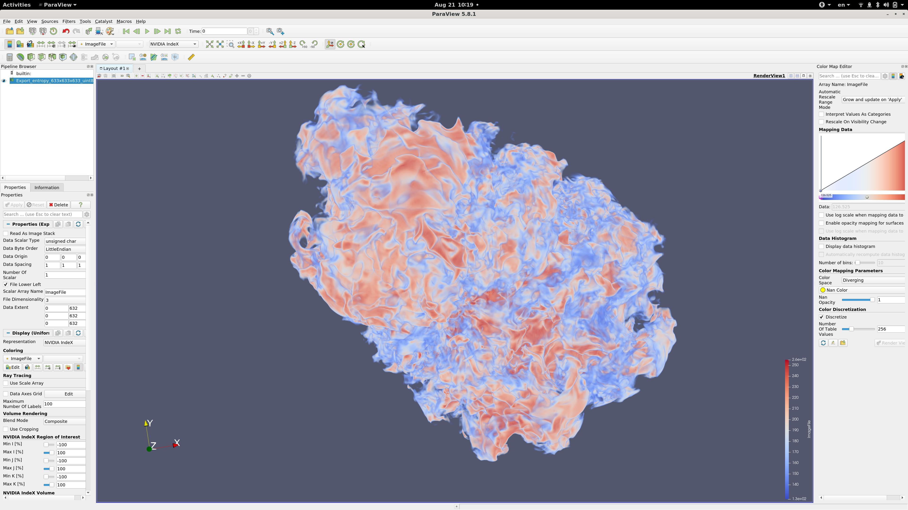

# Cluster Rendering using AWS ParallelCluster and IndeX for ParaView plugin

## Custom Amazon Machine Image (AMI):

- Please go to the [NVIDIA IndeX](TODO) offering in the AWS Marketplace and subscribe to the image.
- Once subscribed, please get the AMI id for your region.
- Note: AMI is associated with an Amazon EC2 Region. An instance needs to be launched in the same region as the AMI. 

## ParallelCluster Configuration:

- If you are new to AWS ParallelCluster refer to this [blog](https://aws.amazon.com/blogs/opensource/aws-parallelcluster/) 
- To install AWS ParallelCluster refer to this [guide](https://docs.aws.amazon.com/parallelcluster/latest/ug/install.html)
  ```sh
  pip3 install aws-parallelcluster==2.8.0 --upgrade --user
  ```
  Important: The custom AMI provided is tied to a specific ParallelCluster version. So make sure to install the specific ParallelCluster version, in this case 2.8.0.

- Please use the parallel cluster configuration [template](pcluster_template.config) to create your config file.
- Once you customized the config file, please copy it to `~/.parallelcluster/config`.
- Note: the template configuration enables remote desktop visualization using NICE DCV. To learn more about about NICE DCV refer [here](https://aws.amazon.com/hpc/dcv/)

## Create the cluster as:

- To create the cluster, please run the following command:
  ```sh
  pcluster create <cluster-name> -c <path-to-config-file>
  ```

- The given config template creates a cluster with 4 `p3.8xlarge` instances for the compute nodes (each with 4 V100 GPUs) and 1 `g4dn.4xlarge` instance for the master node. You can always modify the instance types in the configuration through the `compute_instance_type` and `master_instance_type` fields.

## Connect to the Remote desktop (NICE DCV server) running on the master instance:

- `pcluster dcv connect <cluster-name> -k <your-key.pem>`
- This will start a Remote Desktop session and connect to the master instance using a web browser

## Install ParaView:

- Run the utility script to install ParaView with NVIDIA IndeX enabled *from a shared directory*:
  ```sh
  cd /shared
  /opt/scripts/install-paraview.sh
  ```

It's important to install ParaView to a shared directory so that compute nodes have it as well.

## Cluster Rendering using ParaView:

- Here we will use ParaView in client-server configuration.

- Run a slurm job to start ParaView server on `<nnodes>` number of nodes with `<gpus_per_node>`:

  ```sh
  salloc -N<nnodes> --exclusive
  srun --mpi=pmi2 -N<nnodes> -n<gpus_per_node> --gpus-per-task=1 /opt/scripts/xauth.sh /shared/ParaView-5.8.1-MPI-Linux-Python3.7-64bit/bin/pvserver --force-offscreen-rendering -display :0
  ```

This should output:
  ```
  Waiting for client...
  Connection URL: cs://ip-<master-rank-ip>:11111
  Accepting connection(s): ip-<master-rank-ip>:11111
  ```

- Start the ParaView client and connect it to the server session started above:

  ```sh
  /shared/ParaView-5.8.1-MPI-Linux-Python3.7-64bit/bin/paraview --server-url=cs://ip-<master-rank-ip>:11111
  ```

ParaView will start now connected to the `pvserver` cluster. If you go back to the pvserver slum job output, you should see the client is connected.

- In ParaView Client,  `Click on View → Memory Inspector`. This will display the cluster and rank assignments

## Loading the Sample Dataset

- Fetch the sample supernova dataset in a *shared location*:
```sh
cd ~/Downloads
wget https://nvindex-datasets-us-west2.s3-us-west-2.amazonaws.com/scenes/00-supernova_ncsa_small/data/Export_entropy_633x633x633_uint8_T1074.raw 
```

- Click on `File → Open → <path-to> → Export_entropy_633x633x633_uint8_T1074.raw`
    - Click OK
    - Open Data with `Image Reader`

- Update the properties for this data set.
    - The data set used here is `unsigned char` data type
    - Confirm the Data Byte Order for your system (LittleEndian vs. BigEndian). You can use [this](https://www.geeksforgeeks.org/little-and-big-endian-mystery/) to find out. For example, on a x86 system you would select Little Endian.
    - Data Extent is the X, Y, Z dimension of the dataset (its specified in the name of file). For this dataset it would be [0, 632] for X, Y and Z dimensions.

- Change colouring from `SolidColor` to `ImageFile`.

- Change representation to use the NVIDIA Index renderer: Click on the `Outline` dropdown and select `NVIDIA IndeX`.

- At this point you should see a colured cube. Change the data range (via colormap or `Rescale to Data Range` button) to  to `[25, 255]`.

- At this point you should see the features of the dataset. Feel free to use the colormap to highlight different features.

- Here's a sample rendering screenshot:


- The dataset shown here is a time step in a core-collapse supernovae simulation. [Credits](https://github.com/NVIDIA/nvindex-cloud/blob/master/doc/datasets.md#core-collapse-supernova)
